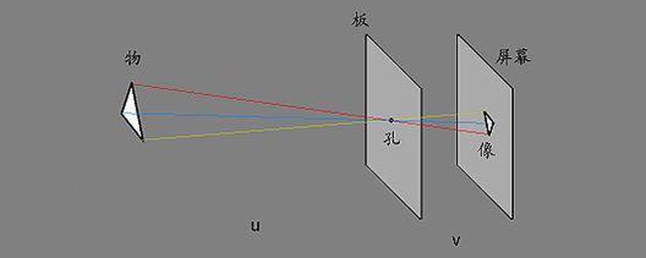
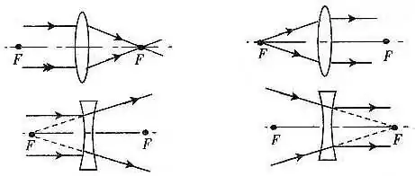
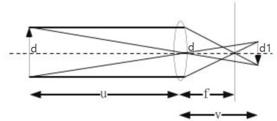

# camera_calibrion
# from  https://github.com/zhiyuanyou/Calibration-ZhangZhengyou-Method.git
# rs_server 415连接
## 相机标定的目的：
### 获取摄像机的内参和外参矩阵（同时也会得到每一幅标定图像的选择和平移矩阵），内参和外参系数可以对之后相机拍摄的图像就进行矫正，得到畸变相对很小的图像。

# pyrealsen2

# 深度相机的原理
## 第一步：相机的成像原理

### 小孔成像 光的直线传播

</picture>

#### 小孔成像实验得到的结论：光在同种均匀物质中沿直线传播。像距不变时，物距越近，像越大且亮度变亮；物距越远，像越小且亮度变暗。物距不变时，屏近像变小，变亮；屏远像变大，变暗。物、孔、屏位置不变时，成像为前提，孔相对大时像变亮

### 凹凸镜片

#### 特点：

#### 1、凹凸镜上的反射现象都遵从光的反射定律。

#### 2、平行于主轴的光线经凹面镜反射后，反射光线会聚于焦点处。凹凸镜的焦点是实际光线的会聚点，因此是实焦点。

#### 3、凹凸镜对光线起会聚作用，因此焦距越小，会聚本领越大。

#### 应用：

#### 1、利用凹凸镜对光线的会聚作用：太阳灶、台灯、电视卫星天线、雷达。

#### 2、利用过焦点的光线经反射后成为平行于主轴的平行光:探照灯、手电筒以及各种机动车的前灯灯罩。

#### 凹透镜成像的几何作图与凸透镜者原则相同。从物体的顶端亦作为两条直线：一条平行于主光轴，经过凹透镜后偏折为发散光线，将此折射光线相反方向返回至主焦点；另一条通过透镜的光学中心点，这两条直线相交于一点，此为物体的像。

## 相机成像原理说明
### 数码相机图像拍摄的过程实际上是一个光学成像的过程。相机的成像过程涉及到四个坐标系： 世界坐标系、 相机坐标系、 图像坐标系、 像素坐标系以及这四个坐标系的转换。 相机模型是光学成像模型的简化， 最基本的透镜成像原理如图1 所示：

# https://blog.csdn.net/weixin_34910922/article/details/121618548
